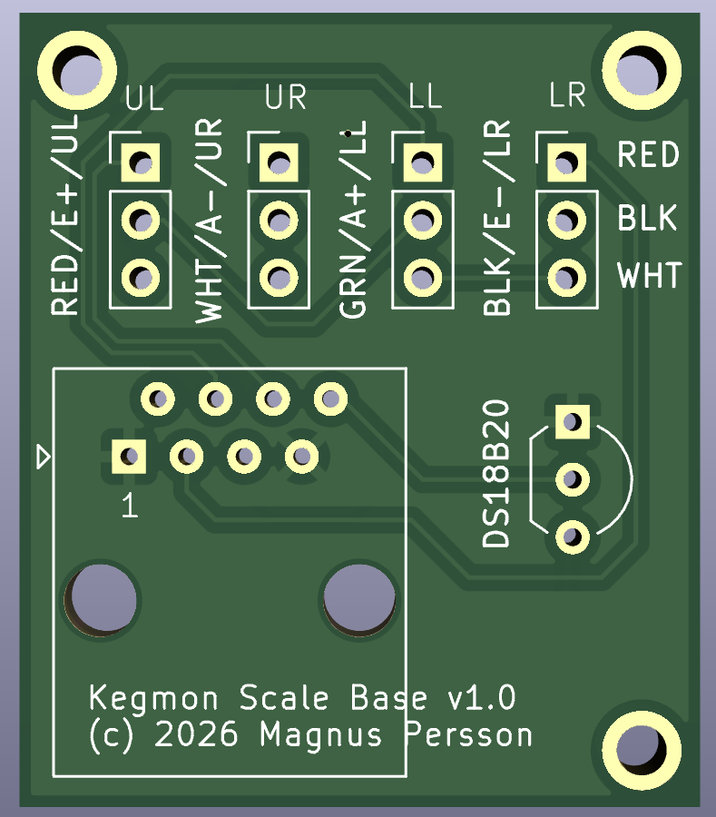
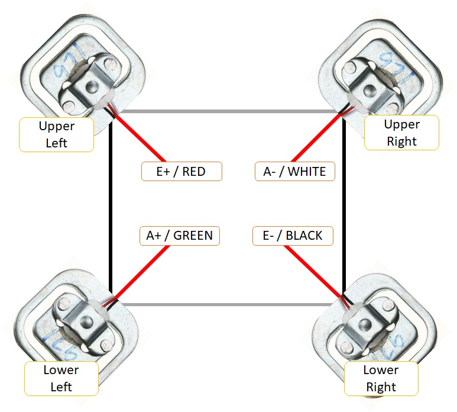
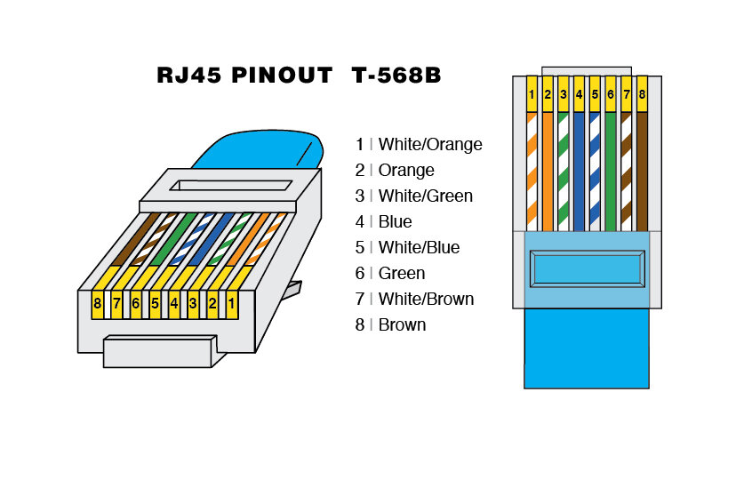
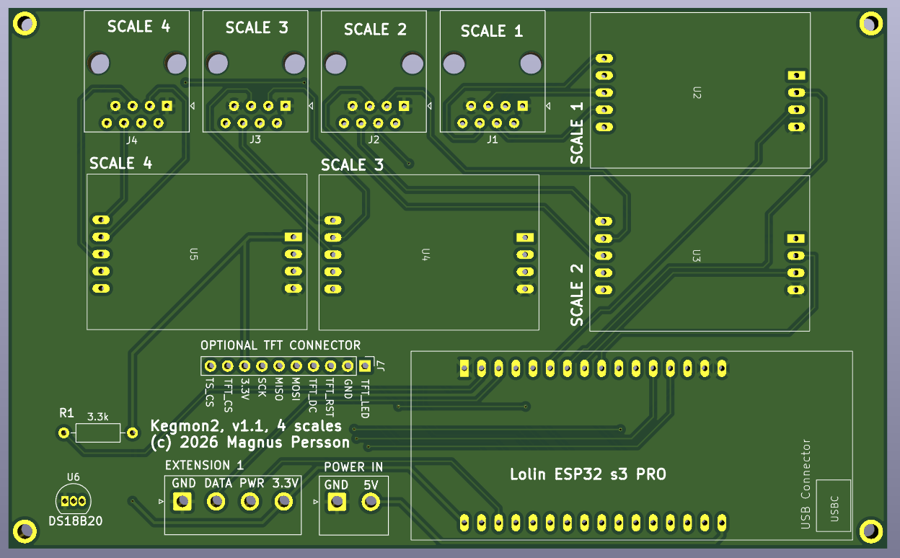

.. _building:

Building a device
=================

Step 1 - Build the scale bases
------------------------------

First you need to build the scale base. You will need the following parts per scale:

* DS18B20 temperature sensor
* Network cable 3-4m (one cable can be split to support 2 scales)
* Load cells (4 x 50kg)
* Scale base PCB 
* 3D Printed scale base

PCB for scale bases to make it easier connect all the cables. The PCB also has room for a RJ45 connector but in the 
current design of the scale bases its not used since it would make the scale base thicker.

Step 1.1 - Printing the scale base
^^^^^^^^^^^^^^^^^^^^^^^^^^^^^^^^^^

The 3D models for the scale bases are hosted in the `3d-designs <https://github.com/mp-se/3d-designs>`_ repository. You can view them interactively below.

.. raw:: html

   
   

     

       <h4>Scale Base</h4>
       <model-viewer src="_static/3d/scale2_base.glb" 
                     style="width: 100%; height: 300px; background-color: #eee;" 
                     auto-rotate camera-controls shadow-intensity="1">
       </model-viewer>
     

     

       <h4>Base Cover</h4>
       <model-viewer src="_static/3d/scale2_base_cover.glb" 
                     style="width: 100%; height: 300px; background-color: #eee;" 
                     auto-rotate camera-controls shadow-intensity="1">
       </model-viewer>
     

   

Step 1.2 - Mount the load cells
^^^^^^^^^^^^^^^^^^^^^^^^^^^^^^^

Start with mounting in the loadcells in the printed base and make sure the cables are ready for soldering on the scale base PCB.

Step 1.3 - Wire the load cells and temperature sensor
^^^^^^^^^^^^^^^^^^^^^^^^^^^^^^^^^^^^^^^^^^^^^^^^^^^^^

Mount and solder the temperature sensor on the scale base PCB as indicated by the silkscreen. ONly DS18B20 sensors with 3 
wires are supported since all the temperature sensors share the same onewire bus.

Mark the load cells acording to this schematic and solder the cables in the position indicated on the PCB, 
one row per load cell. If the cabels are to long make sure you **cut them to the same length**. 

Step 1.4 - Solder the network cable
^^^^^^^^^^^^^^^^^^^^^^^^^^^^^^^^^^^

In order for the scale bases to be as thin as possible i dont use the RJ45 connector on the scale, instead 
solder the cables directly to the PCB using the following color scheme. Pin 1 is marked on the PCB.

Step 1.4 - Validate scale base
^^^^^^^^^^^^^^^^^^^^^^^^^^^^^^

Before closing the scale base its a good idea to validate that everything works, so connect 
it to the controller and calibrate it before continuing to the last step.

Step 1.5 - Glue the base cover
^^^^^^^^^^^^^^^^^^^^^^^^^^^^^^

.. note::
  Don't glue the base togehter before you have validated that it works as intended.

TODO

Step 2 - Build the controller
-----------------------------

First you need to build the hardware which consists of 1 to 4 scale bases, case with the displays, HX711 boards 
and the ESP32. You will need the following parts. If you only want 2 scales just add 2 HX711 boards and 2 
scale bases. If the software does not find an ADC it will disable that scale.

* ESP32 S3 PRO board (Lolin)
* HX711 boards (Purple or Red)
* TFT display (Lolin 2.4" recommended)
* RJ45 connectors
* 3.3kOhm resistor for DS18B20
* Controller PCB for ESP32 and display
* 3D Printed case for display and ESP32
* SD card 2Gb+ (optional for logging)

PCB for 4 scales and display

Step 2.1 - Solder the connectors
^^^^^^^^^^^^^^^^^^^^^^^^^^^^^^^^

.. note::
  The marked DS18B20 is an extension where you can add an extra temperature sensor if 
  you dont want to add them to the scale bases. The areas marked EXTENSION is not yet 
  in use and is for future use.

TBD

Step 2.2 - Solder pins on HX711 boards and ESP32
^^^^^^^^^^^^^^^^^^^^^^^^^^^^^^^^^^^^^^^^^^^^^^^^

TBD

Step 2.3 - Mount the components
^^^^^^^^^^^^^^^^^^^^^^^^^^^^^^^

TODO

Step 2.4 - 3D print the case
^^^^^^^^^^^^^^^^^^^^^^^^^^^^

TODO

Step 3 - Flash the device
-------------------------

The first step is to flash the firmware, I recommend using my webflasher as the easy option. Detailed 
instructions can be found here :ref:`installation`

