.. _configuration:

Configuration
-------------

This guide explains how to configure KegMon through its web interface. Access the device via a web browser using its IP address or mDNS name (e.g., kegmon.local). The interface is divided into sections for device settings, taps, integrations, and tools.

Index
*****

The main dashboard displays general device information, including temperatures and status. Only available data is shown.

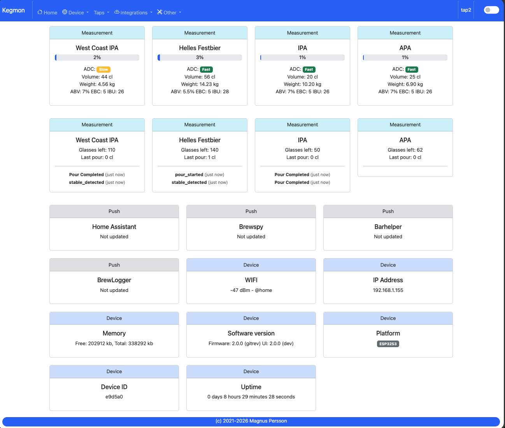

Device - Settings
*****************

Configure general device preferences here.

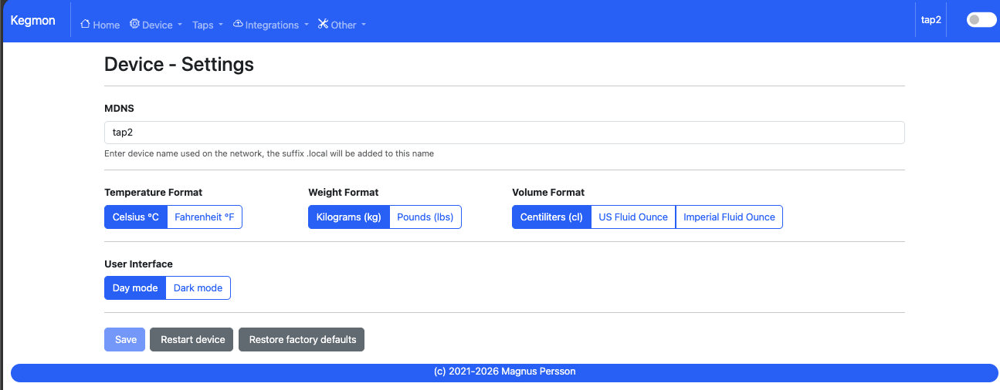

* **MDNS**: Set a custom name for the device on the network (requires mDNS support).
* **Temperature format**: Choose Celsius or Fahrenheit for temperature display.
* **Weight unit**: Select kg or lbs for weight measurements.
* **Volume unit**: Choose cl, UK fl. oz, or US fl. oz for volume display.
* **Dark Mode**: Toggle between light and dark UI themes (also available via the menu bar).

Device - Calibration
********************

Calibrate your scales in three easy steps for accurate weight measurements.

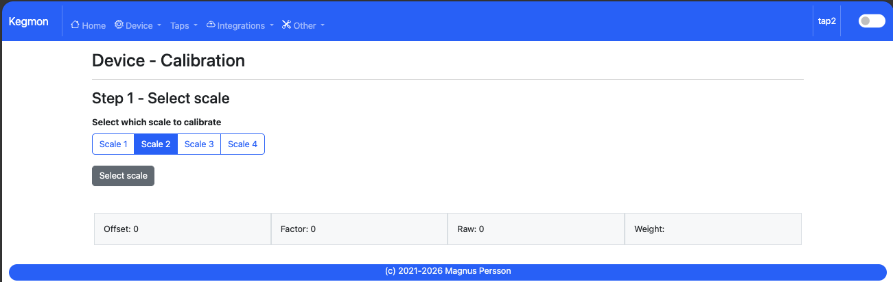

* **STEP 1 - Tare scale**: Select the scale from the dropdown and ensure it's empty, then tare to zero.
* **STEP 2 - Calculate factor**: Place an object of known weight on the scale and enter its weight. The software calculates the calibration factor.
* **STEP 3 - Validate**: Place another object of known weight and verify the reading. If accurate, calibration is complete.

Device - Stability
******************

Monitor the stability of your hardware setup to ensure reliable readings.

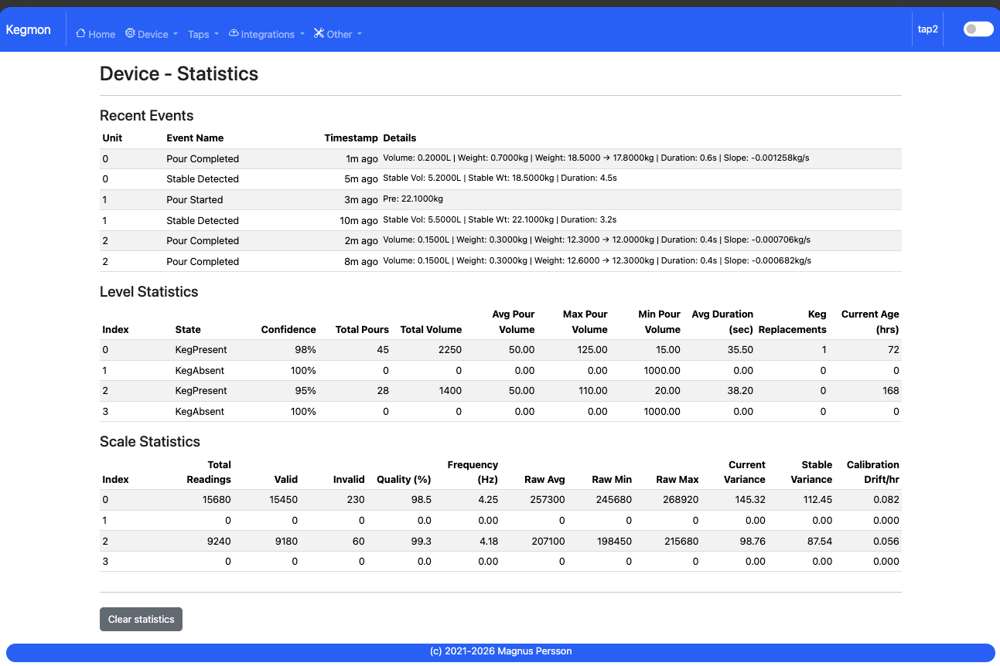

This page helps diagnose unstable builds. Keep the browser open to view historical data (raw, Kalman-filtered, and stable values) for analysis. Data is stored in the browser and resets on refresh.

Device - WiFi
*************

Manage WiFi connections and settings.

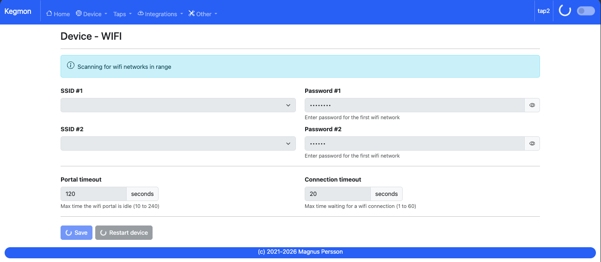

* **SSID #1/Password #1**: Primary network credentials.
* **SSID #2/Password #2**: Secondary network for fallback (optional).
* **Portal timeout**: Time (in seconds) the WiFi portal remains active when triggered (e.g., by tapping reset 2-3 times within 3 seconds).
* **Connect timeout**: Maximum time allowed for WiFi connection attempts.

Taps - Settings
***************

Configure individual tap settings for volume calculations and beer details.

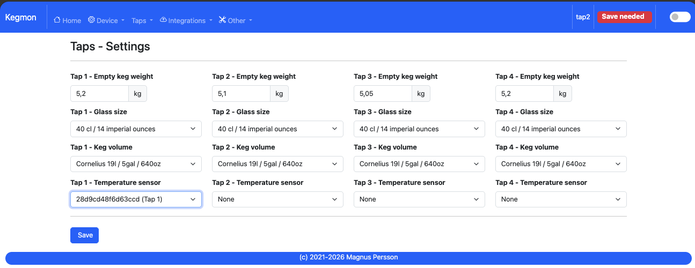

* **Empty keg weight**: Weight of the empty keg, used to calculate remaining beer volume.
* **Glass volume**: Standard glass size for estimating remaining pours.
* **Keg volume**: Standard keg size for validating weight and calculating remaining volume.
* **Temperature sensor**: Connect a temperature sensor to the specific scale base. If not used the first sensor value will be used.

Taps - Beers
************

View and manage beers on tap, with options to import from integrations.

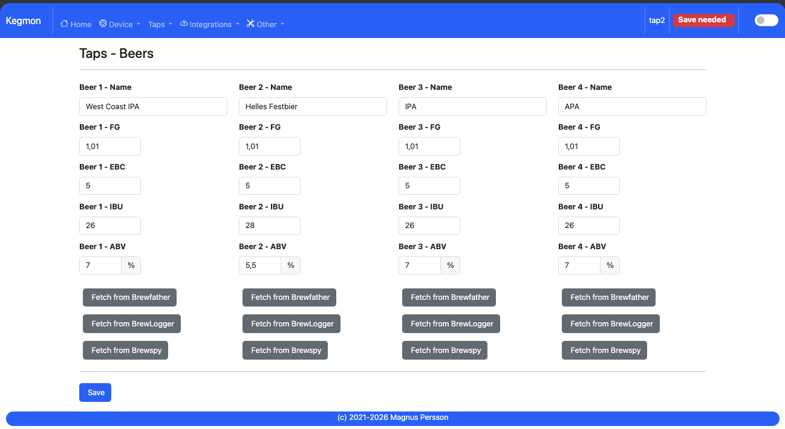

Use buttons to import data from BrewSpy or Brewfather. Beer name, FG, EBC, ABV and IBU are imported if available

Taps - History
**************

Review recent pour history for each tap.

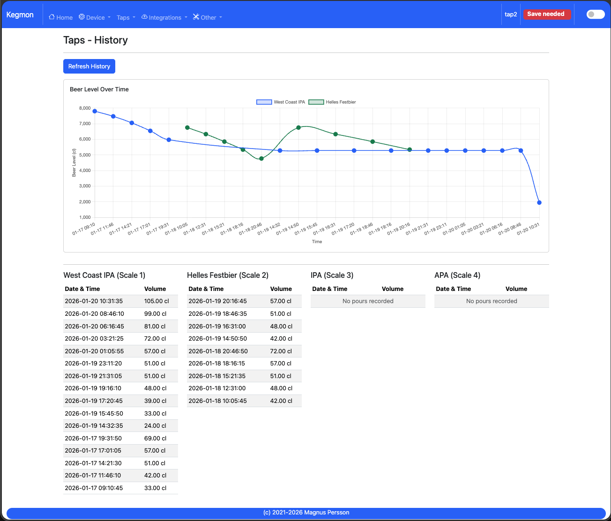

Displays the latest pours for beers on tap.

Integration - Home Assistant
****************************

Set up MQTT for Home Assistant integration.

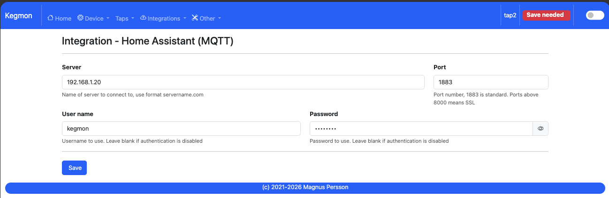

Configure MQTT server details for data export to Home Assistant.

Integration - Brewfather
************************

Connect to Brewfather for brew data import.

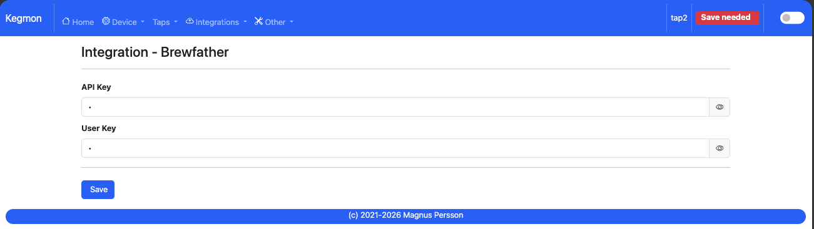

Enter API and user keys for Brewfather access.

Integration - Brewspy
*********************

Link to BrewSpy for keg and beer data.

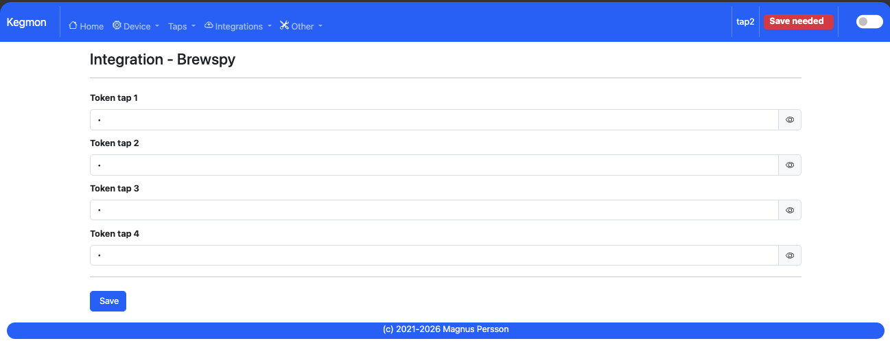

Enter tokens for kegs. Copy the webhook URL code from BrewSpy and paste it here.

Integration - Barhelper
***********************

Integrate with Barhelper for additional monitoring.

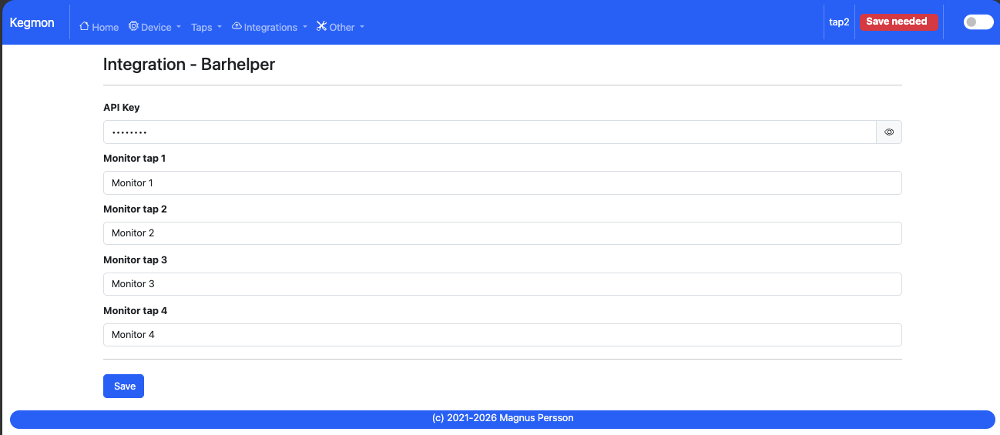

Enter API keys and monitor names. Obtain the key from Barhelper settings (save it securely, as it's not retrievable later). Monitors are added automatically on first run.

Integration - Influx
********************

Send data to InfluxDB for analysis.

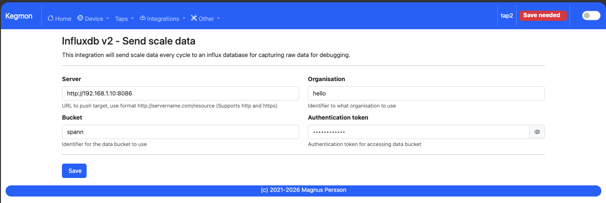

Configure InfluxDB v2 for logging scale and internal parameters. If enabled data will be logged every second for all the scales and paramaters. 

Serial Console
**************

Access device logs for troubleshooting.

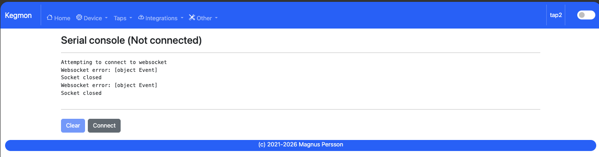

View real-time serial output from the device.

Backup & Recovery
*****************

Manage configuration backups.

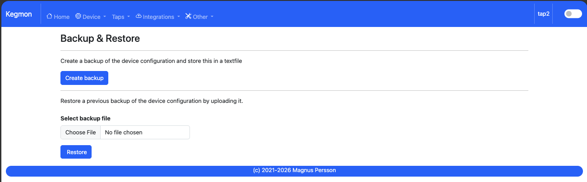

Export current settings or restore from a saved JSON file.

Firmware Update
***************

Update device firmware over-the-air.

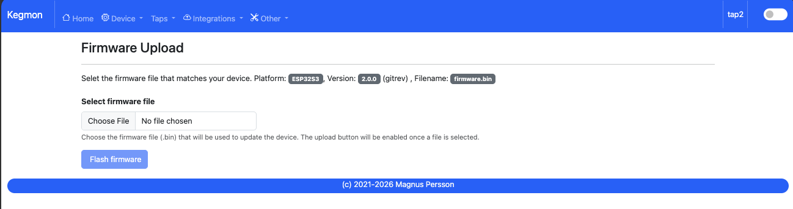

Upload new firmware files without serial connection.

Support
*******

Access diagnostic information.

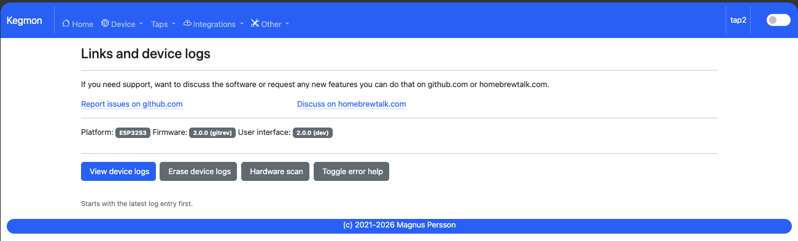

View logs and hardware details.

Tools
*****

Interact with the device's file system.

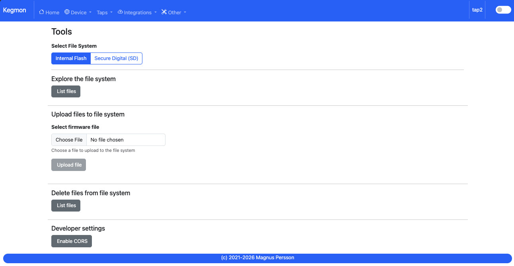

Manage files on the device.
