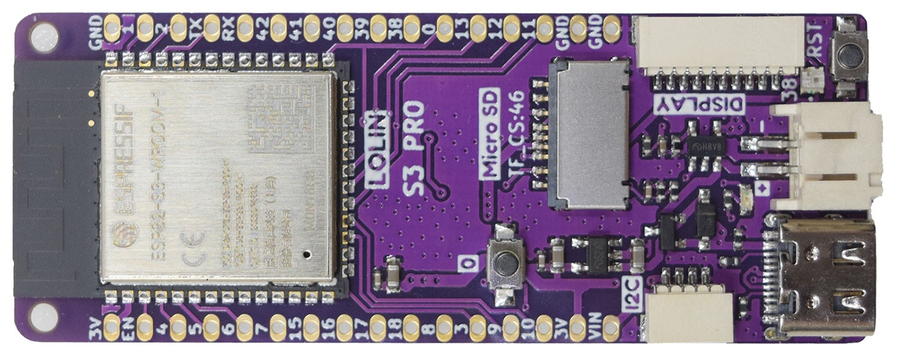
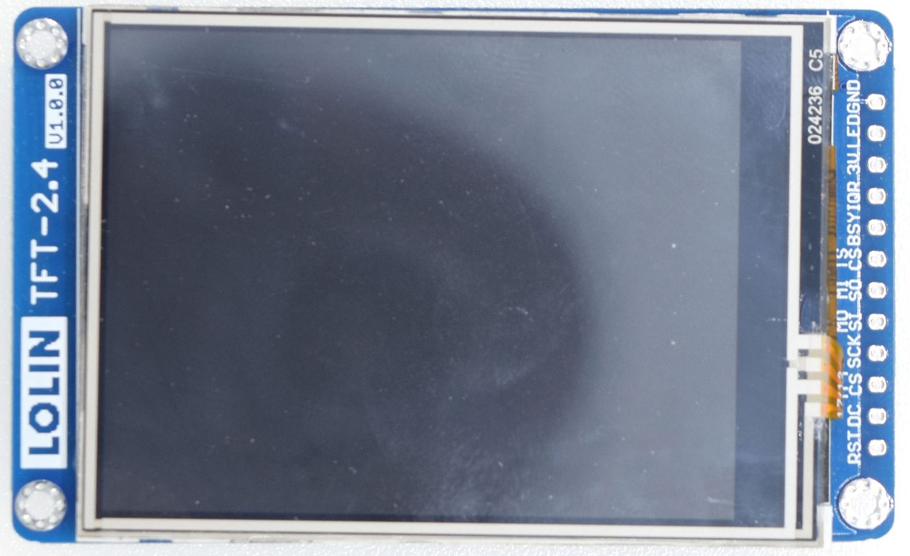
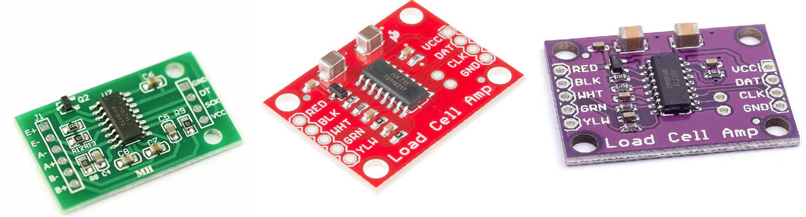

.. KegMon documentation master file, created by
   sphinx-quickstart on Tue Jun  7 09:29:30 2022.
   You can adapt this file completely to your liking, but it should at least
   contain the root `toctree` directive.

Welcome to KegMon2 - Keg Level Monitor
--------------------------------------

.. note::
  Reflects the current v2.0.0 (alfa 1), last reviewed 2026-09-15.

Introduction
============

KegMon is an open-source keg monitoring system designed for homebrewers to track beer levels, pours, and environmental conditions in real-time. The software is tailored to personal needs and integrates with popular services like Brewfather, BrewSpy, and Home Assistant. Suggestions for additional integrations are welcome—feel free to raise requests on GitHub.

The system features two primary interfaces: a graphical TFT display on the device and a web-based interface accessible from any browser. It uses advanced filtering algorithms to compensate for the unpredictability of inexpensive load cells, ensuring stable and accurate readings.

To detect level changes, KegMon employs a dual-filter approach: a fast filter triggers the system into a "pouring" state upon initial weight changes, while slower filters validate the event by measuring the weight drop per second (slope). This helps distinguish genuine pours from minor fluctuations.

The system can handle multiple consecutive pours by stabilizing readings and
splitting larger pours using the configured glass size. It supports up to four
kegs and disables a scale for the session when its HX711 is not found at
startup.

The v2.0.0 update is backward-compatible with scales from previous versions, requiring only a controller upgrade. The project includes:

* Software for managing scales, processing readings, and providing interfaces.
* Hardware designs using standard HX711 AD converters, load cells, and temperature sensors.
* 3D models for keg bases and display enclosures.

Hardware Options
================

Board
*****

The current version exclusively supports the Lolin ESP32 S3 PRO board, which provides the dual-core processing needed for background tasks and advanced filtering. It includes an onboard SD card slot and connectors for the TFT display.

Display
*******

The current firmware builds support these TFT controller variants:

* ILI9341 at 240 x 320 pixels, with or without SD-card support.
* ILI9488 at 480 x 320 pixels, with SD-card support.

The Lolin 2.4-inch ILI9341 display is the documented reference display.

HX711
*****

For the ADC (HX711 board), use a module whose pinout matches the controller
PCB. The firmware measures whether each detected HX711 is operating at 10 or
80 samples per second; it does not require a particular sampling-rate variant.

Verify the module's pinout and wiring before powering the controller. A module
that does not respond during startup leaves that scale disabled.

Temperature Sensor
******************

The system supports DS18B20 one-wire temperature sensors, with the ability to use one per scale base for precise monitoring of each keg's environment.

Credits
=======
Thanks to the following projects and libraries that made KegMon possible:

* https://github.com/mp-se/espframework
* https://github.com/thijse/Arduino-Log
* https://github.com/bblanchon/ArduinoJson
* https://getbootstrap.com
* https://chartjs.org
* https://modelviewer.dev/
* https://github.com/pstolarz/OneWireNg
* https://github.com/pstolarz/Arduino-Temperature-Control-Library
* https://github.com/ESP32Async/ESPAsyncWebServer
* https://github.com/ESP32Async/AsyncTCP
* https://github.com/Bodmer/TFT_eSPI
* https://github.com/RobTillaart/HX711
* https://github.com/lvgl/lvgl

.. toctree::
   :maxdepth: 2
   :caption: Contents:

   
   functionality
   releases
   building
   installation
   configuration
   license
   development
   q_and_a

Indices and tables
==================

* :ref:`genindex`
* :ref:`modindex`
* :ref:`search`
