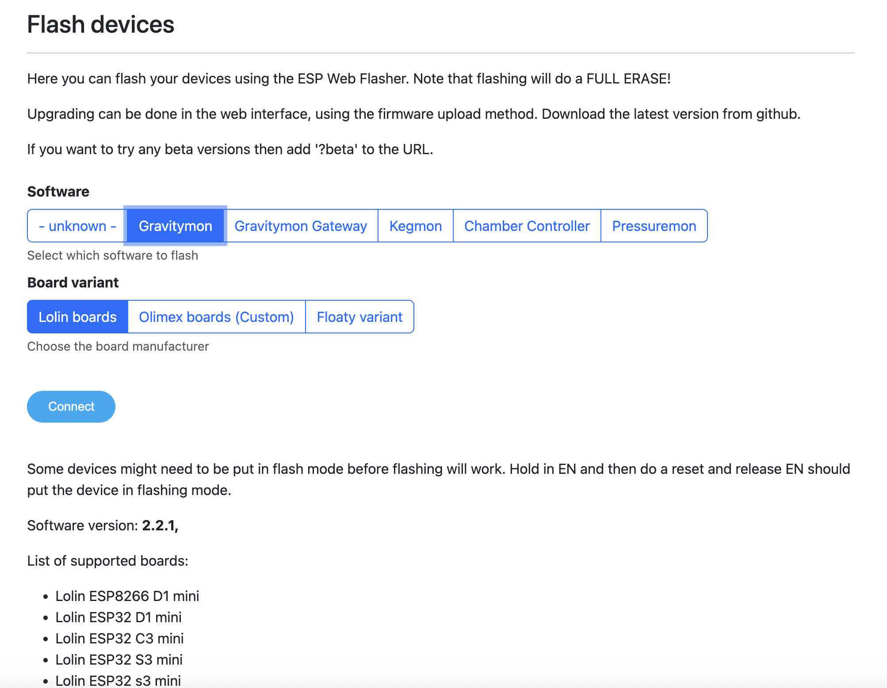

.. _installation:

Software Installation
---------------------

This guide covers installing and setting up KegMon on your ESP32 device, including flashing firmware, configuring WiFi, and accessing the interface.

GravityMon Web Flasher
======================

The GravityMon Web Flasher supports flashing firmware for various projects, including KegMon, and allows WiFi configuration over a serial connection. Access it here: `GravityMon Web Flasher <https://www.gravitymon.com/flasher/index.html/>`_.

Select the software to flash and the board manufacturer; the flasher will automatically use the correct binaries.

.. warning::

  Using the web flasher erases the entire device before flashing, so back up your settings first. For upgrades, use the firmware update feature within the KegMon software.

Manual Update
*************

When the device is in configuration mode, you can manually update the firmware. Open this URL in your web browser: **http://[device-ip]/update** (replace [device-ip] with your device's IP address), then select the appropriate firmware.bin file for the version you want to install.

.. _serial_monitoring:

Serial Monitoring
=================

To view logs and output from the device, use a serial monitoring tool. For Windows, a simple option is the "Serial Port Monitoring" app from the Microsoft Store. Set the baud rate to 115200, 8N1.

For macOS or Linux, tools like `screen` or `minicom` can be used. For example, with `screen`: ``screen /dev/tty.usbserial-XXXX 115200`` (replace with your serial port).

.. _setup_wifi:

WiFi Compatibility
==================

The ESP32 has limited WiFi support and relies on older standards. Consider these guidelines for setup:

* Do not use spaces in your WiFi SSID or password.
* Only 2.4GHz bands are supported, with channels 1-13 (in 802.11 b/g/n modes).
* Channels should be in the 20-25 MHz range.
* The SSID must be visible (hidden SSIDs do not work).

For more details, refer to: https://www.espressif.com/sites/default/files/esp8266_wi-fi_channel_selection_guidelines.pdf

Configuring WiFi
================

After flashing, the device needs WiFi configuration. If previous software was installed, settings may already exist.

To enter WiFi setup mode on a configured device, tap the reset button at least 3 times in 1-2 second intervals (not too fast or too slow).

If unconfigured, the device creates a wireless access point named `GravityMon` with the default password `password`. Connect to this AP, and the configuration page should open automatically. If not, navigate to **http://192.168.4.1** in your browser.

Enter your desired SSID and password. WiFi settings can also be adjusted later under Device > WiFi in the menu.

.. _setup_ip:

Finding the Device Address
==========================

Once WiFi is configured, the device reboots and connects to your network. A flashing blue LED indicates it's ready.

If your system supports mDNS, use the device's network name (e.g., kegmon.local) in your browser. Windows has limited mDNS support, so if issues arise:

* Check your router's admin panel for the device's IP address (e.g., http://192.168.1.56).
* Use an IP scanner or port scanner (available for Windows, macOS, or mobile) to find devices listening on port 80.

Once connected to the web interface, proceed with configuration.

